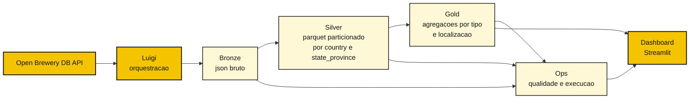
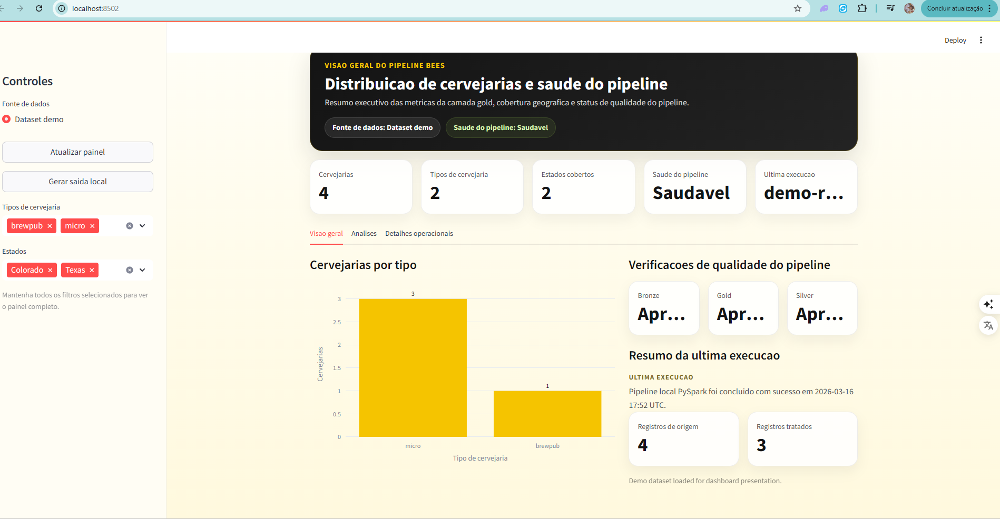

# Case de Engenharia de Dados BEES

Implementacao do case da Open Brewery DB com ingestao real da API em `PySpark`, validada localmente e em `Google Colab`, usando arquitetura medallion e um dashboard em `Streamlit` para a camada de demonstracao.


## Sumario

- [Destaques](#destaques)
- [Visao Rapida do Fluxo](#visao-rapida-do-fluxo)
- [Como Avaliar em 3 Minutos](#como-avaliar-em-3-minutos)
- [Orquestracao do Pipeline](#orquestracao-do-pipeline)
- [Evidencias de Validacao](#evidencias-de-validacao)
- [Previa Visual](#previa-visual)
- [Monitoramento e Alertas](#monitoramento-e-alertas)
- [Testes e CI](#testes-e-ci)

## Destaques

| Ponto | Evidencia |
| --- | --- |
| Fonte | Open Brewery DB API no fluxo principal do case |
| Orquestracao | Pipeline com `Luigi` para coordenar etapas e lidar com falhas |
| Arquitetura | Camadas `bronze`, `silver`, `gold` e `ops` |
| Qualidade | `quality gate` critico com cenario de falha controlada |
| Demonstracao | Quickstart curto, dashboard e evidencias de execucao |
| Confianca | `CI` com smoke tests de `PySpark`, dashboard e orquestracao |

## Visao Rapida do Fluxo



## Resumo operacional

- a API alimenta a ingestao do pipeline
- o `Luigi` coordena as etapas do pipeline, com suporte a retries e falhas
- o `PySpark` transforma os dados nas camadas `bronze`, `silver`, `gold` e `ops`
- o dashboard consome os resultados analiticos e operacionais

## Arquitetura em Alto Nivel

- `bronze`: preserva o payload bruto da API
- `silver`: normaliza colunas, aplica tipos e deduplica `brewery_id`
- `silver`: persiste em `parquet` particionado por `country` e `state_province`
- `gold`: agrega quantidade de breweries por `brewery_type`, `country` e `state_province`
- `ops`: persiste resultados de qualidade e eventos de execucao

## Como Avaliar em 3 Minutos

Rode os comandos abaixo a partir da raiz do repositorio:

```bash
pip install -e ".[dev,local,dashboard]"
python scripts/run_api_pyspark_pipeline.py --output-dir local_output
python -m streamlit run dashboard/app.py
```

Depois:

- abra `http://localhost:8501`
- use `Dataset demo` para a apresentacao mais rapida
- use `Saida local` quando `local_output/` tiver sido gerado

Se quiser um caminho deterministico, sem depender da API durante a demonstracao:

```bash
python scripts/run_local_pyspark_demo.py
```

### Alternativa com Docker

O repositorio tambem inclui um caminho conteinerizado para capturar o bonus de `containerization` do enunciado:

Observacao importante:

- a trilha principal validada para o case continua sendo `local` ou `Google Colab`
- a trilha com `Docker` foi adicionada como caminho opcional de empacotamento e demonstracao do projeto

```bash
docker compose run --rm pipeline
docker compose up dashboard
```

Servicos disponiveis:

- `pipeline`: gera `local_output/` com o fluxo principal em `PySpark`
- `orchestrator`: executa a trilha com `Luigi` e grava artefatos em `luigi_output/`
- `dashboard`: sobe o `Streamlit` em `http://localhost:8501`

Documentacao complementar:

- [Guia rapido do avaliador](./docs/evaluator-quickstart.md)
- [Guia rapido local](./docs/local-quickstart.md)
- [Monitoramento e alertas](./docs/monitoring-alerting.md)
- [Dashboard](./dashboard/README.md)

## Orquestracao do Pipeline

O projeto inclui uma trilha explicita com `Luigi` para orquestrar a execucao do fluxo principal.

Na pratica, isso cobre:

- encadeamento entre `bronze`, `silver`, `gold` e `ops`
- execucao local com `--local-scheduler` e trilha natural para `luigid`
- tentativas de reexecucao por etapa
- interrupcao opcional quando um check critico de qualidade falha

Execucao de exemplo:

```bash
python -m luigi --module orchestration.luigi_pipeline PipelineOrchestration \
  --local-scheduler \
  --output-dir luigi_output \
  --landing-date 2026-03-16 \
  --run-id luigi-run-001
```

Para uma execucao deterministica sem depender da API:

```bash
python -m luigi --module orchestration.luigi_pipeline PipelineOrchestration \
  --local-scheduler \
  --source-mode file \
  --source-file examples/sample_breweries.json \
  --output-dir luigi_output \
  --landing-date 2026-03-16 \
  --run-id luigi-run-001
```

## Evidencias de Validacao

### Execucao de Referencia

Execucao de referencia do fluxo principal a partir da Open Brewery DB API:

As chaves e caminhos abaixo refletem a saida real do script e, por isso, permanecem tecnicos:

```json
{
  "bronze_output_path": "local_output/bronze/landing_date=2026-03-16",
  "silver_output_path": "local_output/silver/breweries",
  "gold_output_path": "local_output/gold/breweries_by_type_location",
  "quality_results_path": "local_output/ops/quality_results",
  "execution_events_path": "local_output/ops/execution_events",
  "source_record_count": 4,
  "silver_record_count": 4,
  "gold_record_count": 3,
  "quality_gate_status": "pass"
}
```

Artefatos esperados:

- `local_output/bronze/landing_date=.../`
- `local_output/silver/breweries/`
- `local_output/gold/breweries_by_type_location/`
- `local_output/ops/quality_results/`
- `local_output/ops/execution_events/`

### Exercicio do Gate de Qualidade

O repositorio inclui um dataset ruim em [examples/sample_breweries_bad.json](./examples/sample_breweries_bad.json).

Esse dataset existe para demonstrar o comportamento do pipeline quando regras criticas de qualidade sao violadas:

```bash
python scripts/run_local_pyspark_demo.py \
  --source-file examples/sample_breweries_bad.json \
  --output-dir local_output_bad \
  --run-id bad-case-001 \
  --landing-date 2026-03-16 \
  --fail-on-critical-quality
```

Resultado esperado:

- o comando termina com erro por design
- `required_fields = fail`
- `duplicate_primary_keys = fail`
- os artefatos em `local_output_bad/` continuam disponiveis para inspecao

## Previa Visual

O dashboard em `Streamlit` consolida:

- distribuicao de breweries por tipo
- concentracao geografica por estado
- status da ultima execucao
- resultado dos checks de qualidade



Visao executiva e operacional do projeto, destacando distribuicao de cervejarias, KPIs da camada `gold` e status de qualidade do pipeline.

## O Que o Avaliador Deve Verificar

- o caminho principal consome a Open Brewery DB API
- `bronze` preserva o payload bruto com metadados de ingestao
- `silver` entrega dados tipados, deduplicados e particionados por localizacao
- `gold` responde a pergunta do case com agregacao por tipo e localizacao
- `ops` registra qualidade e status da execucao
- o dashboard consolida a leitura executiva e operacional do pipeline

## Monitoramento e Alertas

O requisito de observabilidade do case esta coberto em dois niveis:

- no MVP, o pipeline persiste sinais operacionais em `ops/quality_results` e `ops/execution_events`
- na documentacao, o projeto descreve como transformar esses sinais em alertas para falha de pipeline, falha critica de qualidade, atraso de execucao e queda anormal de volume

Resumo do desenho:

- falha de pipeline apos retries: alerta de alta prioridade
- check critico com `status = fail`: falha do job e alerta imediato
- ausencia de execucao no SLA: alerta de frescor
- queda anormal entre `records_in` e `records_out`: alerta de anomalia operacional

Detalhamento completo:

- [Monitoramento e alertas](./docs/monitoring-alerting.md)

## Testes e CI

O repositorio hoje possui:

- testes unitarios de configuracao e qualidade
- testes de qualidade critica
- testes de integracao para `silver`, `gold` e pipeline local ponta a ponta
- validacao rapida em `GitHub Actions` executando o fluxo principal em `PySpark`

## Estrutura Principal

```text
.
|- docs/
|- dashboard/
|- examples/
|- scripts/
|- src/bees_case/
`- tests/
```

## Leitura Recomendada

- [Arquitetura](./docs/architecture.md)
- [Escolha dos servicos](./docs/services.md)
- [Backlog](./docs/backlog.md)
- [Runbook](./docs/runbook.md)
- [Guia Colab/GCP](./docs/gcp-colab-guide.md)

## Escopo Atual

- `implementado e validado`: `PySpark + Streamlit`
- `ambiente principal`: local ou `Google Colab`
- `documentado como evolucao`: `GCP`
- `bonus implementado`: containerizacao com `Docker`

## Referencias

- [Open Brewery DB](https://www.openbrewerydb.org/)
- [Google Colab](https://colab.research.google.com/)
- [PySpark Documentation](https://spark.apache.org/docs/latest/api/python/)
- [Streamlit Documentation](https://docs.streamlit.io/)
