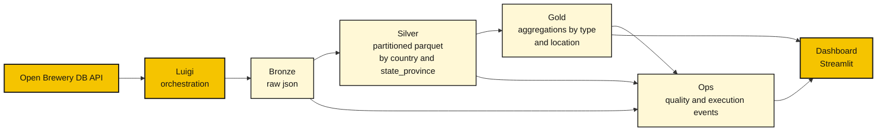

# BEES Data Engineering Case

Implementation of the Open Brewery DB case with real API ingestion in `PySpark`, validated locally and in `Google Colab`, using a medallion architecture and a `Streamlit` dashboard for the presentation layer.


## Summary

- [Highlights](#highlights)
- [Data Source Strategy](#data-source-strategy)
- [Pipeline Overview](#pipeline-overview)
- [How To Evaluate In 3 Minutes](#how-to-evaluate-in-3-minutes)
- [Pipeline Orchestration](#pipeline-orchestration)
- [Validation Evidence](#validation-evidence)
- [Visual Preview](#visual-preview)
- [Monitoring and Alerting](#monitoring-and-alerting)
- [Tests and CI](#tests-and-ci)

## Highlights

| Area | Evidence |
| --- | --- |
| Source | Open Brewery DB API is the primary runtime path for the case |
| Orchestration | `Luigi` coordinates the pipeline and handles retries and failures |
| Architecture | `bronze`, `silver`, `gold`, and `ops` layers are implemented |
| Quality | Critical quality gate with a controlled failure exercise |
| Demonstration | Short quickstart, dashboard, and validation evidence |
| Confidence | Deterministic CI smoke tests plus API-path unit and integration coverage |

## Data Source Strategy

- primary case path: `Open Brewery DB API`
- deterministic support path: local sample dataset for demo, CI, and reproducibility
- the pipeline stores source provenance in `ops/execution_events`

Recorded operational fields include:

- `requested_source_mode`
- `source_type`
- `fallback_used`
- `fallback_reason`
- `source_api_base_url`
- `pages_requested`
- `records_fetched`

## Pipeline Overview



## Operational Summary

- the API feeds the main ingestion path
- `Luigi` coordinates the pipeline stages with retry and failure handling
- `PySpark` transforms data across the `bronze`, `silver`, `gold`, and `ops` layers
- the dashboard combines analytical and operational outputs

## High-Level Architecture

- `bronze`: preserves the raw API payload
- `silver`: normalizes columns, applies types, and deduplicates `brewery_id`
- `silver`: persists `parquet` partitioned by `country` and `state_province`
- `gold`: aggregates brewery counts by `brewery_type`, `country`, and `state_province`
- `ops`: persists quality results and execution events

## How To Evaluate In 3 Minutes

Run the commands below from the repository root:

```bash
pip install -e ".[dev,local,dashboard]"
python scripts/run_api_pyspark_pipeline.py --output-dir local_output
python -m streamlit run dashboard/app.py
```

Then:

- open `http://localhost:8501`
- use `Demo Dataset` for the fastest presentation path
- use `Local Output` once `local_output/` has been generated

If you want a deterministic path that does not depend on live API availability during the demo:

```bash
python scripts/run_local_pyspark_demo.py
```

This alternate path exists for:

- local reproducibility
- deterministic demonstrations
- stable CI validation

### Optional Docker Path

The repository also includes a containerized path to capture the optional `containerization` bonus from the prompt.

Important note:

- the primary validated runtime for the case remains `local` or `Google Colab`
- the `Docker` path mirrors the deterministic demo and orchestration flow and should be treated as an optional packaging and presentation path

```bash
docker compose run --rm pipeline
docker compose up dashboard
```

Available services:

- `pipeline`: generates deterministic `local_output/` with `PySpark`
- `orchestrator`: runs the deterministic `Luigi` path and writes artifacts to `luigi_output/`
- `dashboard`: serves `Streamlit` at `http://localhost:8501`

Supporting documentation:

- [Evaluator quickstart](./docs/evaluator-quickstart.md)
- [Local quickstart](./docs/local-quickstart.md)
- [Monitoring and alerting](./docs/monitoring-alerting.md)
- [Dashboard](./dashboard/README.md)

## Pipeline Orchestration

The project includes an explicit `Luigi` path to orchestrate the end-to-end flow.

In practice, this covers:

- task dependencies between `bronze`, `silver`, `gold`, and `ops`
- local scheduling with `--local-scheduler` and a natural handoff to `luigid`
- per-stage retries
- optional fail-fast behavior when a critical quality check fails

Example run:

```bash
python -m luigi --module orchestration.luigi_pipeline PipelineOrchestration \
  --local-scheduler \
  --output-dir luigi_output \
  --landing-date 2026-03-16 \
  --run-id luigi-run-001
```

For a deterministic execution that does not depend on the live API:

```bash
python -m luigi --module orchestration.luigi_pipeline PipelineOrchestration \
  --local-scheduler \
  --source-mode sample \
  --source-file examples/sample_breweries.json \
  --output-dir luigi_output \
  --landing-date 2026-03-16 \
  --run-id luigi-run-001
```

## Validation Evidence

### Reference Execution

Reference execution for the API-first path:

The keys and paths below reflect the real script output and therefore remain technical:

```json
{
  "bronze_output_path": "local_output/bronze/landing_date=2026-03-16",
  "silver_output_path": "local_output/silver/breweries",
  "gold_output_path": "local_output/gold/breweries_by_type_location",
  "quality_results_path": "local_output/ops/quality_results",
  "execution_events_path": "local_output/ops/execution_events",
  "source_record_count": 4,
  "silver_record_count": 4,
  "gold_record_count": 3,
  "quality_gate_status": "pass"
}
```

Expected artifacts:

- `local_output/bronze/landing_date=.../`
- `local_output/silver/breweries/`
- `local_output/gold/breweries_by_type_location/`
- `local_output/ops/quality_results/`
- `local_output/ops/execution_events/`

The operational artifacts also record source provenance for each execution, including:

- requested source mode
- effective source type
- whether fallback was used
- fallback reason
- requested pages
- fetched record count

### Quality Gate Exercise

The repository includes a bad dataset in [examples/sample_breweries_bad.json](./examples/sample_breweries_bad.json).

This dataset exists to demonstrate pipeline behavior when critical quality rules are violated:

```bash
python scripts/run_local_pyspark_demo.py \
  --source-file examples/sample_breweries_bad.json \
  --output-dir local_output_bad \
  --run-id bad-case-001 \
  --landing-date 2026-03-16 \
  --fail-on-critical-quality
```

Expected result:

- the command fails by design
- `required_fields = fail`
- `duplicate_primary_keys = fail`
- artifacts in `local_output_bad/` remain available for inspection

## Visual Preview

The `Streamlit` dashboard consolidates:

- brewery distribution by type
- geographic concentration by state
- latest execution status
- quality check results


Executive and operational project view highlighting brewery distribution, `gold`-layer KPIs, and pipeline quality status.

## What The Evaluator Should Verify

- the primary path consumes the Open Brewery DB API
- `bronze` preserves the raw payload with ingestion metadata
- `silver` delivers typed, deduplicated data partitioned by location
- `gold` answers the case question with aggregation by type and location
- `ops` records quality and execution status
- the dashboard consolidates the executive and operational view of the pipeline

## Monitoring and Alerting

The observability requirement from the case is covered at two levels:

- in the MVP, the pipeline persists operational signals in `ops/quality_results` and `ops/execution_events`
- in the documentation, the project describes how those signals become alerts for pipeline failure, critical quality failure, stale execution, and unexpected volume drops

Summary of the design:

- pipeline failure after retries: high-priority alert
- critical check with `status = fail`: immediate failure and alert
- missing execution within the SLA window: freshness alert
- abnormal drop between `records_in` and `records_out`: operational anomaly alert

Full details:

- [Monitoring and alerting](./docs/monitoring-alerting.md)

## Tests and CI

The repository currently includes:

- unit tests for configuration, API behavior, and quality helpers
- critical quality tests
- integration tests for `silver`, `gold`, and the local `PySpark` pipeline
- `GitHub Actions` smoke tests for the deterministic `PySpark` and `Luigi` runtime paths
- API-path behavior covered by unit and integration tests with mocked API responses, which keeps CI stable and reproducible

## Main Structure

```text
.
|- docs/
|- dashboard/
|- examples/
|- scripts/
|- src/bees_case/
`- tests/
```

## Recommended Reading

- [Architecture](./docs/architecture.md)
- [Service choices](./docs/services.md)
- [Backlog](./docs/backlog.md)
- [Runbook](./docs/runbook.md)
- [Colab/GCP guide](./docs/gcp-colab-guide.md)

## Current Scope

- `implemented and validated`: `PySpark + Streamlit`
- `primary runtime`: local or `Google Colab`
- `documented evolution`: `GCP`
- `optional bonus implemented`: `Docker` containerization

## References

- [Open Brewery DB](https://www.openbrewerydb.org/)
- [Google Colab](https://colab.research.google.com/)
- [PySpark Documentation](https://spark.apache.org/docs/latest/api/python/)
- [Streamlit Documentation](https://docs.streamlit.io/)
