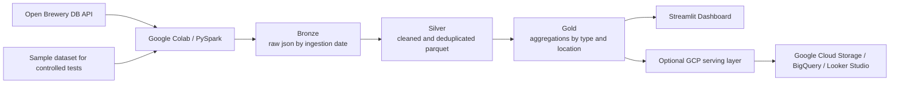

# Arquitetura

## Visao geral

O desenho abaixo prioriza simplicidade, aderencia ao case e execucao pratica em `Google Colab + PySpark`, com uma trilha natural de evolucao para `GCP`.

## Fluxo por camada

### Bronze

- `PySpark` consome a Open Brewery DB API ou dados de exemplo controlados.
- Os payloads sao gravados em `json`.
- Particionamento inicial por `ingestion_date=YYYY-MM-DD`.
- Objetivo: preservar o dado bruto para replay e auditoria.

### Silver

- `PySpark` le os arquivos bronze.
- Normaliza schema, remove duplicidades, padroniza tipos e trata nulos.
- Grava em `parquet` no caminho local/Colab.
- Particionamento recomendado: `country` e `state_province`.

### Gold

- `PySpark` gera tabelas agregadas.
- Foco principal do case:
  - quantidade de breweries por `brewery_type`
  - quantidade de breweries por localizacao
  - quantidade de breweries por `brewery_type + country + state_province`

## Decisoes principais

- `Google Colab` foi escolhido como caminho principal porque permite validar o case rapidamente sem overhead de infraestrutura.
- `PySpark` foi mantido como tecnologia central para aderir ao perfil do desafio.
- `Streamlit` entra como camada de consumo e demonstracao do valor do pipeline.
- `GCP` foi definido como trilha natural de cloud por combinar bem com `Colab`.

## O que foi herdado de cada referencia

- [ocamposfaria/bees-data-engineering-case](https://github.com/ocamposfaria/bees-data-engineering-case): modularizacao, clareza de organizacao e foco em reproducibilidade.
- [Gabriel0598/BEES-Breweries-Case](https://github.com/Gabriel0598/BEES-Breweries-Case): referencia de organizacao em cloud, adaptada aqui para uma trilha opcional e nao obrigatoria.
- [brunobws/aws-api-capture-dl-medallion](https://github.com/brunobws/aws-api-capture-dl-medallion): data quality, observabilidade, historico operacional e backlog mais maduro.
- [wuldson-franco/breweries_case](https://github.com/wuldson-franco/breweries_case): separacao simples de camadas e foco em consumo final.

## Regras de implementacao

- O repositorio deve ser original: inspiracao sim, copia literal nao.
- O MVP precisa funcionar em `Google Colab` sem depender de uma cloud especifica.
- Qualquer cloud futura deve ser uma evolucao da solucao, nao um bloqueio para o uso do projeto.
- Cada camada deve ser reprocessavel de forma independente.
