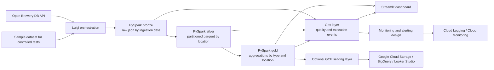

# Architecture

## Overview

The design below prioritizes simplicity, adherence to the case requirements, and practical execution in `Google Colab + PySpark`, with a natural evolution path to `GCP`.

## Layer-by-Layer Flow

### Bronze

- `PySpark` consumes the Open Brewery DB API or controlled sample data.
- Payloads are written in `json`.
- Initial partitioning uses `ingestion_date=YYYY-MM-DD`.
- Goal: preserve raw data for replay and auditability.

### Silver

- `PySpark` reads the bronze files.
- It normalizes the schema, removes duplicates, standardizes types, and handles nulls.
- It writes `parquet` in the local or Colab path.
- Partitioning is implemented by `country` and `state_province`.

### Gold

- `PySpark` produces aggregated outputs.
- Main focus of the case:
  - brewery count by `brewery_type`
  - brewery count by location
  - brewery count by `brewery_type + country + state_province`

### Ops

- Centralizes operational signals from the pipeline.
- Persists quality checks in `ops/quality_results`.
- Persists execution events in `ops/execution_events`.
- Feeds the dashboard and the monitoring and alerting strategy.

## Key Design Decisions

- `Google Colab` is the primary runtime because it validates the case quickly without infrastructure overhead.
- `PySpark` remains the core technology to align with the preferred technical profile of the challenge.
- `Luigi` is the lightweight orchestrator used to make dependencies, retries, and error handling explicit.
- `Streamlit` provides the consumption layer and helps demonstrate business value.
- `GCP` is the natural cloud evolution path because it fits well with `Colab`.

## Design Principles

- modularization to separate ingestion, transformation, quality, observability, and consumption
- reproducibility through a sample dataset, short quickstart, and smoke tests
- demonstration-first mindset, with dashboard and success/failure validation paths
- clear evolution path to cloud without blocking the local MVP

## Implementation Rules

- The repository must be original: inspiration is fine, literal copying is not.
- The MVP must run in `Google Colab` without depending on a specific cloud provider.
- Any future cloud setup should be an evolution of the solution, not a prerequisite for using the project.
- Each layer must be independently reprocessable.
