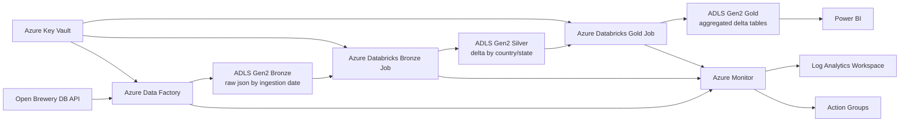

# Arquitetura

## Visao geral

O desenho abaixo prioriza simplicidade, aderencia ao case e alinhamento com Azure.

## Fluxo por camada

### Bronze

- `Azure Data Factory` consome a Open Brewery DB API via REST connector.
- Os payloads sao gravados em `json` no `ADLS Gen2`.
- Particionamento inicial por `ingestion_date=YYYY-MM-DD`.
- Objetivo: preservar o dado bruto para replay e auditoria.

### Silver

- `Azure Databricks` le os arquivos bronze.
- Normaliza schema, remove duplicidades, padroniza tipos e trata nulos.
- Grava em `Delta` no `ADLS Gen2`.
- Particionamento recomendado: `country` e `state_province`.

### Gold

- `Azure Databricks` gera tabelas agregadas.
- Foco principal do case:
  - quantidade de breweries por `brewery_type`
  - quantidade de breweries por localizacao
  - quantidade de breweries por `brewery_type + country + state_province`

## Decisoes principais

- `Azure Data Factory` foi escolhido no lugar de Airflow para manter o projeto mais Azure-native.
- `ADLS Gen2` foi escolhido no lugar de MinIO ou S3.
- `Azure Databricks` foi escolhido no lugar de Glue, Lambda e Spark standalone.
- `Power BI` entra no lugar de Metabase ou Streamlit como camada de consumo principal.
- `Azure Monitor` + `Action Groups` substituem a estrategia de observabilidade baseada em CloudWatch e SES.

## O que foi herdado de cada referencia

- [ocamposfaria/bees-data-engineering-case](https://github.com/ocamposfaria/bees-data-engineering-case): modularizacao, clareza de organizacao e foco em reproducibilidade.
- [Gabriel0598/BEES-Breweries-Case](https://github.com/Gabriel0598/BEES-Breweries-Case): espinha dorsal `ADF + ADLS Gen2 + Databricks`.
- [brunobws/aws-api-capture-dl-medallion](https://github.com/brunobws/aws-api-capture-dl-medallion): data quality, observabilidade, historico operacional e backlog mais maduro.
- [wuldson-franco/breweries_case](https://github.com/wuldson-franco/breweries_case): separacao simples de camadas e foco em consumo final.

## Regras de implementacao

- O repositorio deve ser original: inspiracao sim, copia literal nao.
- O MVP precisa funcionar sem depender de servicos fora do ecossistema Azure.
- Tudo que for segredo deve sair de arquivo local e ir para o `Azure Key Vault`.
- Cada camada deve ser reprocessavel de forma independente.
